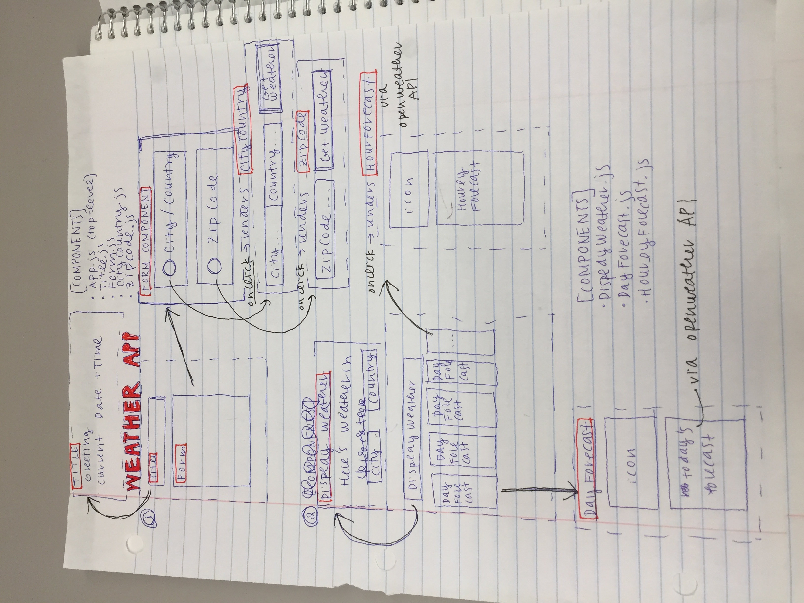

# weather-channel-app

  <h1> Weather Channel App: </h1>
  <h2> This is a weather app built in React to help practice Web Development, React, CSS, and using APIs. </h2>
  <h3> Proposed Functionalities: </h3>
<ul>
  <li>Seperate React Components for Title, Form, Weather</li>
  <li>openweatherapi call to get local weather information</li>
  <li>Add React routes for top level page showing 5-day forecast and clicking on a day shows hourly forecast</li>
  <li>Make it pretty!!! Hopefully improve my eye for design hahaha</li>
</ul>

